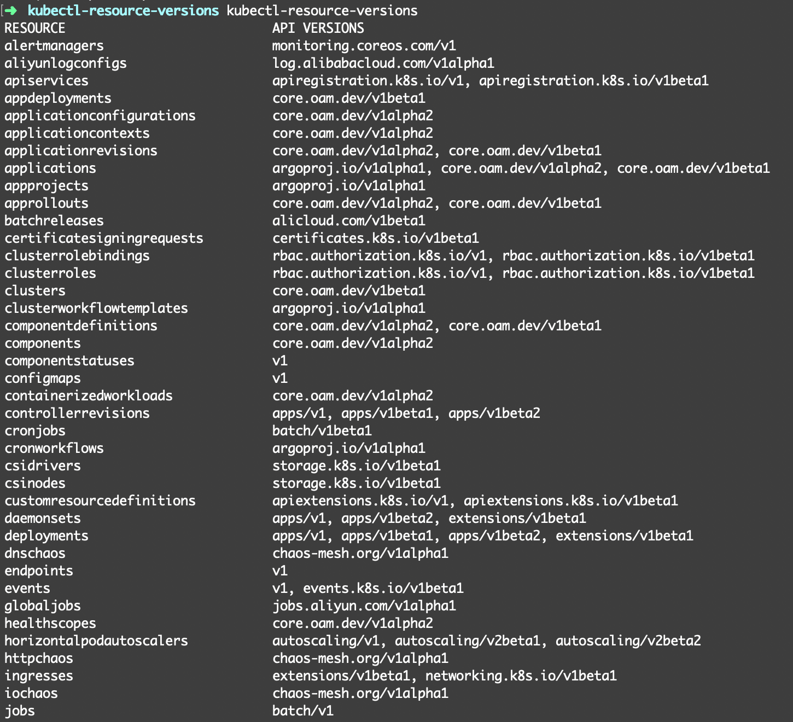

# kubectl-resource-versions

[](https://travis-ci.com/chengshiwen/kubectl-resource-versions)
[](https://goreportcard.com/report/chengshiwen/kubectl-resource-versions)
[](https://github.com/chengshiwen/kubectl-resource-versions/blob/master/LICENSE)
[](https://github.com/chengshiwen/kubectl-resource-versions/releases)

kubectl-resource-versions - kubectl plugin to print the supported API resource versions on the server

## Intro

Have you ever wondered which api group and version should be used for a specified resource on a provided kubernetes cluster?

In one deployment definition you could see this `apiVersion: apps/v1beta2`, and in another `apiVersion: apps/v1`. Which one is correct? Which you should use? How to check which are supported on your Kubernetes cluster?

It is useful to find out the matrix of resources and api versions by using this kubectl plugin are shown below.



## Install

Binary downloads of the `kubectl-resource-versions` can be found on [the Releases page](https://github.com/chengshiwen/kubectl-resource-versions/releases).

Unpack the `kubectl-resource-versions` binary and add it to your PATH and you are good to go!

If you want to use the kubectl plugins package manager [Krew](https://github.com/kubernetes-sigs/krew), just run

```bash
$ kubectl krew install resource-versions
```

## Usage

```bash
$ kubectl-resource-versions --help
Print the supported API resource versions on the server

Usage:
  kubectl resource-versions [flags]

Examples:
  # Print the supported API resource versions
  kubectl resource-versions

Flags:
  -h, --help   help for kubectl
```

## Reference

[Kubernetes API Resources: Which Group and Version to Use?](https://akomljen.com/kubernetes-api-resources-which-group-and-version-to-use/)
